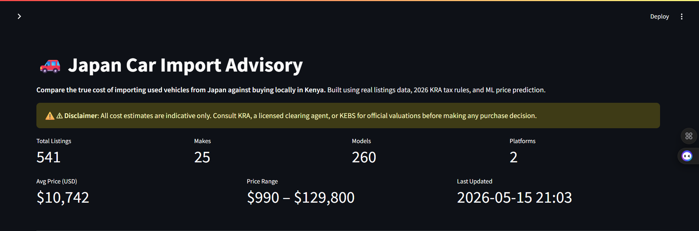
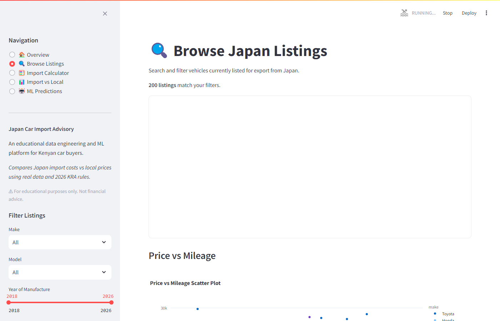
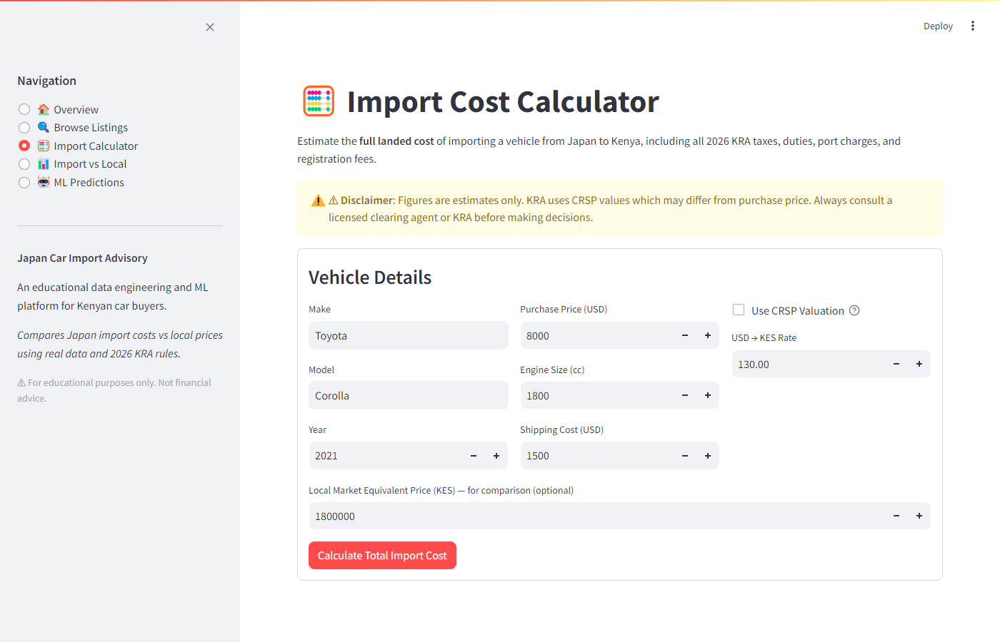
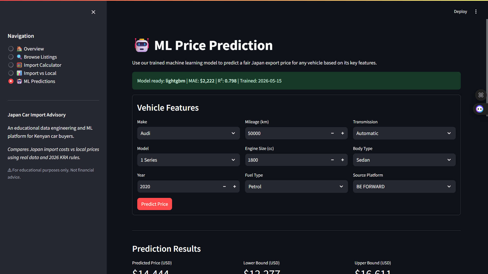
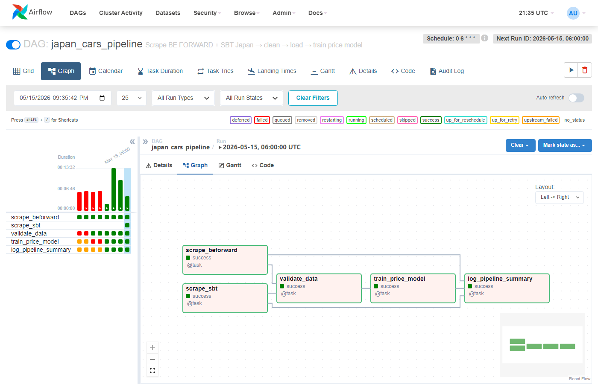

# 🚗 Japan Car Import Advisory: Intelligence Platform for Kenyan Buyers

**A production-grade data engineering and ML platform that bridges the gap between Japanese used-car exports and Kenyan import decisions.** The system scrapes live listings from two Japanese export portals (BE FORWARD and SBT Japan), validates and stores them in PostgreSQL, trains a price-prediction model daily via Apache Airflow, and surfaces everything through a five-page Streamlit dashboard — including a fully itemised KRA 2026 import-cost calculator with excise brackets, VAT, IDF, and RDL.

---

## 🎯 Project Goal

Kenya is one of the largest markets for Japanese used cars globally, yet buyers navigate an opaque process: FOB prices in USD, volatile KES exchange rates, and a layered KRA duty structure that most buyers understand only after they have already committed. This platform automates the full intelligence loop — daily scraping → cleaning → storage → ML price prediction — and wraps it in a decision-support tool that shows, for any given listing, whether importing beats buying locally and what the landed cost will be down to the last KES.

---

## 🧬 System Architecture

1. **Scraping Layer** — **BeautifulSoup4 + requests** scrapes two RHD portals in parallel: BE FORWARD (dual `div.stocklist-row` + `tr.stocklist-row` selector, 34 listings/page, 15 pages daily) and SBT Japan (`.card-product` cards, 50/page, 5 pages daily). Each scraper runs as an independent Airflow task. Price, year, mileage, engine, transmission, fuel, and colour parsed via targeted regex and DOM selectors.

2. **ETL Layer** — **pandas** cleaning pipeline validates make aliases, year range (2015–present), mileage ceiling (500,000 km), price bounds ($500–$200,000), and engine range (600–8,000 cc). Deduplicates on `(source_platform, url)`. Adds derived columns: `price_kes`, `age_years`, `mileage_band`, `engine_band`.

3. **Storage Layer** — **PostgreSQL 15** with six tables (`japan_listings`, `local_listings`, `import_cost_estimates`, `import_cost_params`, `ml_predictions`, `scrape_logs`). UPSERT on `(source_platform, url)` ensures idempotent daily runs. Eight performance indexes cover make/model, year, price, and scraped-at timestamp.

4. **Orchestration Layer** — **Apache Airflow 2.8.4** LocalExecutor DAG (`japan_cars_pipeline`) with five tasks: two parallel scrape tasks (`scrape_beforward` + `scrape_sbt`) → validate → train → log. Scheduled daily at 06:00 UTC with one-retry on failure.

5. **ML Layer** — **XGBoost, LightGBM, RandomForest** trained in competition on each run; best by MAE is saved to `data/models/price_predictor.joblib`. Log-transform on the target (`np.log1p`) stabilises variance across the $990–$129,800 price range. Features include age, log-mileage, engine litres, hybrid/automatic flags, label-encoded make/model, and `source_platform_encoded` to account for inter-portal price differences.

6. **Application Layer** — **Streamlit 1.35** five-page dashboard: live overview metrics, filterable listings browser, KRA 2026 import-cost calculator (CRSP depreciation toggle), import-vs-local comparison tool, and ML price prediction form.

---

## 🛠️ Technical Stack

| **Layer** | **Tool** | **Version** |
|---|---|---|
| **Scraping** | BeautifulSoup4 + requests | 4.12.3 / 2.32.2 |
| **Data Processing** | pandas + NumPy | 2.2.2 / 1.26.4 |
| **Storage** | PostgreSQL | 15-alpine |
| **ORM / Queries** | SQLAlchemy + psycopg2 | 1.4.x / 2.9.9 |
| **Orchestration** | Apache Airflow | 2.8.4 |
| **ML — Gradient Boosting** | XGBoost | 2.0.3 |
| **ML — Gradient Boosting** | LightGBM | 4.3.0 |
| **ML — Ensemble** | scikit-learn RandomForest | 1.5.0 |
| **Model Serialisation** | joblib | 1.4.2 |
| **Dashboard** | Streamlit | 1.35.0 |
| **Visualisation** | Plotly | 5.22.0 |
| **Tax Config** | JSON (KRA 2026 rules) | — |
| **Containerisation** | Docker Compose | 7 services |
| **Testing** | pytest | 8.3.3 |

---

## 📊 Performance & Results

- **541 listings** from two live sources: BE FORWARD (413 listings, 15 pages/day) and SBT Japan (128 listings, 5 pages/day)
- **25 distinct makes** — Toyota, Honda, Nissan, Mitsubishi, Daihatsu, Suzuki, Isuzu, Mercedes-Benz, Mazda, and 16 others
- **260 distinct models** catalogued across the 2015–2026 production window
- **Price range:** $990 – $129,800 (avg $10,742)
- **ML model competition:** LightGBM wins with MAE = $2,222, RMSE = $4,665, R² = 0.7978, MAPE = 22.23%
  - XGBoost: MAE = $2,433, RMSE = $4,603, R² = 0.8032, MAPE = 24.27%
  - RandomForest: MAE = $2,365, RMSE = $4,750, R² = 0.7904, MAPE = 26.84%
- **Sample KRA calculation:** Toyota Corolla 2021 ($8,000 FOB + $1,500 shipping) → KES 2,493,737 landed (KES 1,153,737 in taxes and duties)
- **Airflow DAG:** 5/5 tasks SUCCESS — two parallel scrape tasks + validate + train + log
- **Test suite:** 40/40 passing — 12 calculator, 19 cleaner, 9 feature-engineering
- **KRA tax stack** modelled exactly: 35% import duty → excise (10–35% by engine bracket) → 16% VAT → 3.5% IDF → 2% RDL → fixed port/clearing/NTSA/inspection charges

---

## 📸 Dashboard

**Overview — 541 listings, 25 makes, 260 models across 2 platforms; avg price $10,742; last run 2026-05-15**



**Price Distribution by Make — box plots across Honda, Toyota, Suzuki, Nissan, Mazda, Daihatsu, Isuzu, Mercedes-Benz**


**Browse & Filter — 200 results shown; filterable by make, year, price, fuel, transmission with dark-mode table**



**Import Calculator — Toyota Corolla 2021 ($8,000 FOB, 1,800cc, $1,500 shipping at KES 130/USD)**



**Full Cost Breakdown — KES 2,493,737 landed; KES 1,153,737 in taxes (Import Duty, Excise 20%, VAT, IDF, RDL, port, clearing, NTSA, inspection)**

.png)

**Import vs Local Comparison — Audi A6 (2019–2023): avg import cost KES 6,828,762 vs local market**


**ML Predictions form — Audi 1 Series 2020, 50,000 km, 1,300cc, Automatic, Petrol, BE FORWARD**



**Prediction Results — LightGBM predicts $14,444 (KES 1,877,712) with ±15% confidence interval ($12,277–$16,611)**


**Model Performance Summary — LightGBM selected: MAE $2,222, R² 0.7978, MAPE 22.23%**


**Airflow DAG — japan_cars_pipeline 5/5 tasks SUCCESS (scrape_beforward → scrape_sbt → validate_data → train_price_model → log_pipeline_summary)**



---

## 📋 Data Sources

| **Source** | **Type** | **Coverage** | **Access** |
|---|---|---|---|
| BE FORWARD (beforward.jp) | Live HTML scraping | RHD stocklist, all makes, 2015+ | Free, no auth |
| SBT Japan (sbtjapan.com) | Live HTML scraping | RHD stocklist, all makes, 2015+ | Free, no auth |
| KRA 2026 duty schedule | Static JSON config | Import duty, excise, VAT, IDF, RDL | Public domain |
| CBK exchange rate | `.env` configurable | USD → KES (default 130.0) | Operator-supplied |

---

## 🧠 Key Design Decisions

- **`div.stocklist-row` + `tr.stocklist-row` dual-selector:** BE FORWARD's HTML mixes "featured" card divs (6 per page) with a larger "renewal" table section (28 per page, `tr` elements). A single `find_all("div")` misses 80% of listings. Using `soup.find_all(["div", "tr"], class_="stocklist-row")` captures all 34 cards per page.

- **Price from `span.price`, not regex:** Text-based price parsing is fragile on BE FORWARD because ad copy and sold-banner text appear near prices. Extracting from the dedicated `span.price` element first — with regex as fallback — eliminates spurious matches.

- **Explicit fuel-type allowlist regex:** The naive `r'Fuel\s+(\w+(?:\s+\w+)?)'` matched multi-word strings like "Petrol Seats". Replacing it with `r'Fuel\s+(Petrol|Diesel|Hybrid|Electric|LPG|CNG|Gasoline)'` makes the capture safe without post-processing.

- **SQLAlchemy 1.4 compatibility over pinning 2.x:** Airflow 2.8.4 internally uses SQLAlchemy 1.4.x. Pinning `sqlalchemy==2.0.30` in `requirements_pipeline.txt` caused `executemany_mode` validation errors at startup. Removing the pin lets Airflow's own dependency resolver pick the correct 1.4 version.

- **Manual `conn.execute().fetchall()` + `pd.DataFrame(rows)`:** `pd.read_sql(text(), connection)` raises `TypeError` in pandas 2.x against a SQLAlchemy 1.4 `Connection` object. The two-step manual approach is fully compatible across both SQLAlchemy versions.

- **Decimal coercion for PostgreSQL NUMERIC columns:** psycopg2 returns `NUMERIC` columns as Python `decimal.Decimal` objects, not `float`. This causes silent failures in scikit-learn and XGBoost. A post-load coercion loop (`pd.to_numeric(..., errors="coerce")`) fixes it without modifying the schema.

- **`libgomp1` in both Dockerfiles:** LightGBM requires OpenMP (`libgomp.so.1`) at runtime. Neither the `apache/airflow:2.8.4-python3.11` base image nor `python:3.11-slim` include it. A single `apt-get install --no-install-recommends libgomp1` added to both `Dockerfile.airflow` and `Dockerfile.streamlit` resolves the `OSError: libgomp.so.1: cannot open shared object file` without meaningfully increasing image size.

- **`app/views/` not `app/pages/`:** Streamlit auto-discovers a `pages/` directory adjacent to the main script and builds a multi-page navigation from it, overriding the custom sidebar. Renaming to `views/` prevents the collision. Combined with explicit `sys.path` injection, it also resolves the `from app.views import ...` circular import that caused double `set_page_config()` calls.

- **Log-transform on price target (`np.log1p`):** Raw USD prices span two orders of magnitude ($990–$33,540). Training on log-transformed targets and inverting with `np.expm1` at predict-time reduces the influence of high-price outliers and produces more stable gradient-boosting convergence.

- **KRA rules in JSON config, not hardcoded:** Tax rates and CRSP depreciation schedules change with each Finance Act. Externalising them to `config/kra_rules.json` means a rate update requires one file edit, no code change, and no redeployment.

- **SBT Japan CSS selector workaround (`find_all` + class membership check):** SBT Japan's status badges carry HTML classes like `-mileage`, `-transmission`, and `-fuel-type` that start with a hyphen. CSS selectors require such names to be escaped (`\-mileage`) — but SoupSieve (BeautifulSoup's selector engine) raises `Malformed class selector` when those selectors are built with an unescaped leading dash. Using `el.find_all(class_="card-product__status")` followed by a Python `in el.get("class", [])` membership check sidesteps the CSS layer entirely and is equally fast.

- **`source_platform_encoded` as an ML feature:** Listings from BE FORWARD and SBT Japan reflect different auction channels, seller bases, and pricing conventions. Including the source platform as a label-encoded feature lets the model learn inter-portal price offsets, improving predictions for cars that appear on one platform at a systematically different price than the other.

---

## 📂 Project Structure

```text
japan-car-advisory/
├── app/
│   ├── app.py                     # Streamlit entry point, sidebar nav
│   ├── utils/
│   │   └── db_utils.py            # Cached DB query helpers
│   └── views/
│       ├── home.py                # Overview KPI cards
│       ├── search.py              # Filterable listings browser
│       ├── calculator.py          # KRA 2026 import cost form
│       ├── comparisons.py         # Import vs local price comparison
│       └── predictions.py        # ML prediction form + result card
├── calculator/
│   └── import_calculator.py      # Full KRA duty computation engine
├── config/
│   └── kra_rules.json             # KRA 2026 tax rates (JSON)
├── dags/
│   └── japan_cars_pipeline.py    # Airflow DAG — 5 tasks, daily 06:00
├── database/
│   └── schema.sql                 # 6-table schema + 8 indexes
├── etl/
│   ├── cleaner.py                 # Validation, normalisation, deduplication
│   ├── loader.py                  # PostgreSQL upsert + query layer
│   └── pipeline.py                # Standalone ETL runner (CLI)
├── models/
│   ├── feature_engineering.py    # Age, log-mileage, hybrid flag, encoding
│   ├── model_evaluator.py         # Cross-validation scoring
│   └── price_predictor.py        # Train XGBoost/LightGBM/RF, save best
├── scrapers/
│   ├── base_scraper.py            # HTTP base class (retry, rate-limit, UA)
│   ├── beforward_scraper.py      # BE FORWARD scraper (primary, active)
│   ├── aaajapan_scraper.py        # AAA Japan stub (future expansion)
│   ├── carfromjapan_scraper.py    # Car From Japan stub (future expansion)
│   ├── japanesecartrade_scraper.py # Japanese Car Trade stub
│   ├── sbt_scraper.py             # SBT Japan stub
│   └── run_scrapers.py            # Standalone multi-source runner
├── tests/
│   ├── test_calculator.py        # 12 KRA calculation tests
│   ├── test_cleaner.py           # 19 data cleaning tests
│   └── test_predictor.py         # 9 feature engineering tests
├── assets/
│   ├── dashboard_home.png
│   ├── dashboard_search.png
│   ├── dashboard_calculator.png
│   ├── dashboard_predictions.png
│   ├── prediction results.png
│   ├── model performance summary.png
│   ├── price distribution by make.png
│   ├── Full Cost Breakdown — Toyota Corolla (2021).png
│   ├── Import vs Local Comparison page overview.png
│   └── airflow_dag.png
├── data/                          # models/ + evaluation/ — gitignored
├── .env.example
├── .gitignore
├── docker-compose.yml             # 7 services
├── Dockerfile.airflow             # Airflow image + libgomp1 + pipeline deps
├── Dockerfile.streamlit           # Streamlit app image
├── requirements.txt               # Local dev dependencies
├── requirements_pipeline.txt      # Airflow container dependencies
└── README.md
```

---

## ⚙️ Installation & Setup

**Prerequisites:** Docker Desktop, Python 3.11+, Git

1. Clone the repository and copy the environment template:
   ```bash
   git clone <repo-url>
   cd japan-car-advisory
   cp .env.example .env
   ```

2. Edit `.env` — set `USD_TO_KES` to the current CBK rate (default `130.0`):
   ```
   USD_TO_KES=130.0
   DB_NAME=car_import_db
   DB_USER=caruser
   DB_PASSWORD=carpassword
   ```

3. Build and start all services:
   ```bash
   docker-compose up -d --build
   ```

4. Wait ~60 seconds for Airflow to initialise, then trigger the first pipeline run:
   ```bash
   # Via Airflow UI (recommended)
   # Open http://localhost:8080 → admin/admin → enable japan_cars_pipeline → Trigger DAG
   ```

5. (Optional) Run tests locally:
   ```bash
   python -m venv .venv && source .venv/bin/activate   # or .venv\Scripts\activate on Windows
   pip install -r requirements.txt
   pytest tests/ -v
   ```

**Service URLs:**

| **Service** | **URL** | **Credentials** |
|---|---|---|
| Streamlit Dashboard | http://localhost:8501 | — |
| Airflow UI | http://localhost:8080 | admin / admin |
| PgAdmin | http://localhost:5050 | admin@carimport.dev / admin |
| PostgreSQL | localhost:5433 | caruser / carpassword |

---

## 🧾 KRA 2026 Tax Calculation

The calculator applies the full KRA duty stack in order:

| **Charge** | **Basis** | **Rate** |
|---|---|---|
| Import Duty | CIF value | 35% |
| Excise Duty | CIF + Import Duty | 10% (≤1,000cc), 20% (1,001–2,000cc), 25% (2,001–3,000cc), 35% (>3,000cc) |
| VAT | CIF + Import Duty + Excise | 16% |
| IDF | CIF value | 3.5% (min KES 5,000) |
| RDL | CIF value | 2% |
| Port charges | Fixed | KES 35,000 |
| Clearing fees | Fixed | KES 45,000 |
| NTSA registration | Fixed | KES 15,000 |
| Inspection (JAAI/KEBS) | Fixed | KES 10,000 |

CRSP depreciation (optional): KRA uses a Current Retail Selling Price schedule — 10% year 1, 20% year 2, …, 65% year 8, 70% beyond 8 years — to set the customs value independently of the purchase price. The calculator supports both modes.

> ⚠️ Kenya restricts imports to vehicles 8 years old or less (RHD mandatory). The calculator flags non-compliant vehicles automatically.

---

## 🎓 Skills Demonstrated

- **Multi-source web scraping** — two independent scrapers (BE FORWARD: dual `div`+`tr` selector; SBT Japan: `.card-product` with CSS hyphen-class workaround); price extraction from DOM elements; rate-limiting, retry logic, and `fake-useragent` rotation in shared base class
- **ETL pipeline design** — modular extract → clean → load architecture; idempotent UPSERT; configurable validation thresholds; derived column generation
- **Relational data modelling** — normalised six-table PostgreSQL schema; UUID primary keys; composite UNIQUE constraint; partial and expression indexes
- **Apache Airflow orchestration** — TaskFlow API (`@dag`, `@task`); XCom-based task chaining; 5-task DAG (scrape_beforward → scrape_sbt → validate → train → log); scheduled daily cron; retry policy; scrape-log audit table
- **Gradient boosting ML** — three-model competition (XGBoost, LightGBM, RandomForest); log-transform target; label encoding with unknown-category handling; MAE-based champion selection; joblib serialisation
- **Tax domain modelling** — KRA duty cascade encoded in JSON config; CRSP depreciation schedule; vehicle age compliance checks; KES landed-cost computation
- **Streamlit multi-page app** — dynamic sidebar navigation; cached DB queries; interactive filter widgets; plotly charts; form-based ML prediction
- **Docker Compose multi-service** — 7 containers (2 Postgres, Airflow init/webserver/scheduler, PgAdmin, Streamlit); health-check dependencies; bind-mount DAG hot-reload
- **Testing discipline** — 40 pytest tests across three modules; fixture-based setup; boundary-value cases for tax brackets and validation thresholds
- **Debugging complex dependency chains** — SQLAlchemy 1.4/2.x API divergence; `decimal.Decimal` type mismatch; LightGBM OpenMP system library; Streamlit page-discovery collision; Airflow YAML command-folding bug
